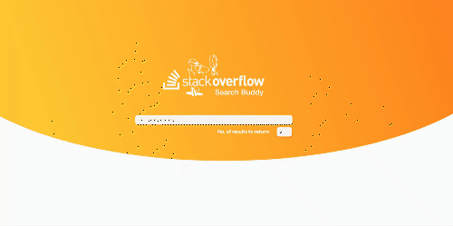
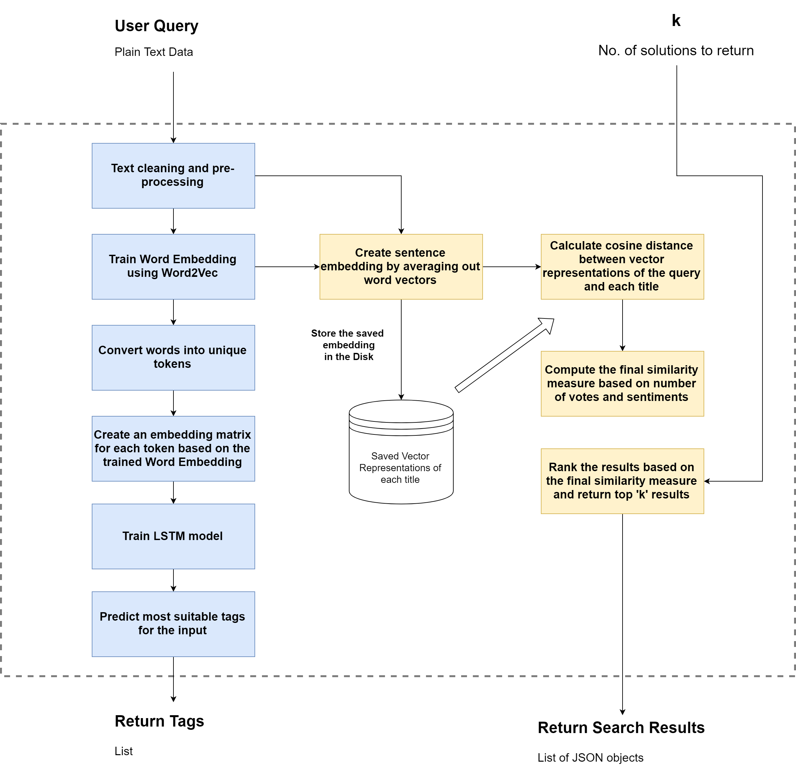

# Semantic Search for Stackoverflow
 
 
<!-- .element height="50%" width="100%" -->

###Problem Statement
**Stack overflow** provides one of the largest learning resources for programmers. Users post questions/doubts and his fellow peers try to provide solutions in the most helpful manner possible. The better an answer, the higher votes it gets, which also increase a user's reputation.

However, this huge amount of information makes it difficult to search for the solution you are looking for. It is not that big of an issue for Domain experts and other experienced professionals, because they are aware of the correct keywords required to get an appropriate answer. However, for a new programmer, this poses a great concern. For instance, if he needs to learn ‘how to make a server’ using Python, it is quite unlikely that he would use the terms ‘Django’ or ‘Flask’ in the search box. Thus, this might intimidate the user to use the platform.

###Proposed Solution

**The Application Architecture**

**The Brain**

What we want is for the platform to actually understand the semantics of what the user is trying to search for, and then return the most helpful results for him. **Natural Language Processing (NLP)** has come a long way since its inception in the 20th century. We decided to use this subfield of Artificial Intelligence in order to solve our problem. NLP has proven to work very well in the past few years due to development of fast processors, GPUs and sophisticated model architectures.

## How to Install
1. Clone the repository using `git clone https://github.com/agrawal-rohit/stackoverflow-semantic-search.git`
2. In order to run the cells in the Jupyter notebooks, you need have `jupyter-notebook` installed in your python environment. This is optional, because the outputs have already been saved and included.
3. Enter the folder **flask server** using `cd stacksearch webapp/flask server/` and run `pip install -r requirements.txt` from your python environment in order to install the required libraries.
4. The server can now be started by entering the folder **flask server** and running `python app.py`. The server should be up and running on http://127.0.0.1:5000/
5. Since the web interface has been written in ReactJS, you need to install `npm`. You can do so from [this link](https://nodejs.org/en/)
6. Enter the **react frontend** folder using `cd stacksearch webapp/react frontend/`
7. Install the required modules using `npm install`
8. Finally, you can start the web interface by running `npm start`. The web interface should be up and running on http://localhost:3000/

### Limirations and Future improvement
Given the vast amount of data given on Stack overflow, I decided to exercise a few constraints for the proof of concept:
1.	I have restricted the data to only Python Related Questions
2.	I have restricted the possible tags to 500
3.	I have used somewhat lower amounts of data points (~140,000) for faster processing 
4. Since this project is mostly just a proof of concept, The web interface makes consecutive API calls to the server. **This is not optimal for a production environment**, and has only been added for visual aesthetic.

Further improvements may include:
- Experiment to solve the problem using Topic Modelling or other sophisticated NLP tasks
- Consider larger number of data points
- Experiment with different architectures for the final classification network
